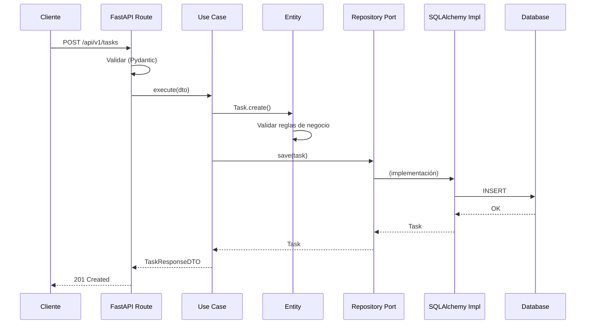

# 🎯 Task Management Hexagonal FastAPI

API REST para gestión de tareas construida con **FastAPI** y **Arquitectura Hexagonal** (Ports & Adapters).

## 📋 Tabla de Contenidos

- [Características](#-características)
- [Arquitectura](#️-arquitectura)
- [Stack Tecnológico](#️-stack-tecnológico)
- [Estructura del Proyecto](#-estructura-del-proyecto)
- [Instalación](#-instalación)
- [Uso](#-uso)
- [Testing](#-testing)
- [API Endpoints](#-api-endpoints)
- [Decisiones de Diseño](#-decisiones-de-diseño)
- [Licencia](#-licencia)

---

## ✨ Características

- ✅ **CRUD completo** de tareas
- ✅ **Arquitectura Hexagonal** (Ports & Adapters)
- ✅ **Domain-Driven Design** (DDD)
- ✅ **Principios SOLID**
- ✅ **Autenticación JWT**
- ✅ **Validación con Pydantic v2**
- ✅ **Migraciones con Alembic**
- ✅ **Testing completo** (Unit, Integration, E2E)
- ✅ **Containerización con Docker**
- ✅ **Documentación automática** (OpenAPI/Swagger)

---

## 🏗️ Arquitectura

### Diagrama de Capas

```
┌─────────────────────────────────────────────────────┐
│         INFRASTRUCTURE LAYER (Adaptadores)          │
│  ┌──────────┐  ┌──────────┐  ┌──────────────────┐   │
│  │ FastAPI  │  │SQLAlchemy│  │  JWT Service     │   │
│  │ Routes   │  │Repository│  │  (Auth)          │   │
│  └──────────┘  └──────────┘  └──────────────────┘   │
└────────────────────┬────────────────────────────────┘
                     │ implementa
                     ▼
┌─────────────────────────────────────────────────────┐
│         APPLICATION LAYER (Casos de Uso)            │
│  ┌───────────────────────────────────────────────┐  │
│  │  CreateTask | GetTask | UpdateTask | ...      │  │
│  └───────────────────────────────────────────────┘  │
└────────────────────┬────────────────────────────────┘
                     │ usa
                     ▼
┌─────────────────────────────────────────────────────┐
│              DOMAIN LAYER (Núcleo)                  │
│  ┌──────────┐  ┌────────────┐  ┌────────────────┐   │
│  │  Task    │  │  Priority  │  │TaskRepository  │   │
│  │ Entity   │  │Value Object│  │   Port (ABC)   │   │
│  └──────────┘  └────────────┘  └────────────────┘   │
│                                                     │
│             Sin dependencias externas               │
└─────────────────────────────────────────────────────┘
```

### Flujo de una Request



### Principios Aplicados

#### 1. **Dependency Inversion Principle (DIP)**
- El dominio define **puertos** (interfaces)
- La infraestructura implementa **adaptadores**
- Las dependencias apuntan **hacia adentro** (hacia el dominio)

```python
# DOMINIO define QUÉ necesita
class TaskRepository(ABC):
    async def save(self, task: Task) -> Task: ...

# INFRAESTRUCTURA implementa CÓMO
class SQLAlchemyTaskRepository(TaskRepository):
    async def save(self, task: Task) -> Task:
        # Implementación específica
```

#### 2. **Single Responsibility Principle (SRP)**
- **Entities**: Lógica de negocio y reglas de dominio
- **Use Cases**: Orquestación de operaciones
- **Repositories**: Solo persistencia
- **Controllers**: Solo manejo de HTTP

#### 3. **Open/Closed Principle (OCP)**
- Fácil agregar nuevos casos de uso sin modificar existentes
- Fácil cambiar de BD sin tocar dominio

---

## 🛠️ Stack Tecnológico

| Componente | Tecnología | Versión |
|------------|-----------|---------|
| Framework | FastAPI | 0.128.0 |
| Lenguaje | Python | 3.13+ |
| Base de Datos | PostgreSQL | 15 |
| ORM | SQLAlchemy | 2.0+ |
| Migraciones | Alembic | 1.18+ |
| Validación | Pydantic | 2.12+ |
| Testing | Pytest | 9.0+ |
| Autenticación | JWT (python-jose) | 3.5.0 |

---

## 📁 Estructura del Proyecto

```
task-management-hexagonal-fastapi/
├── src/
│   ├── __init__.py
│   │
│   ├── domain/                          # CAPA DE DOMINIO (Núcleo)
│   │   ├── __init__.py
│   │   ├── entities/
│   │   │   ├── __init__.py
│   │   │   ├── task.py                 # Entidad Task con lógica de negocio
│   │   │   └── user.py                 # Entidad User con lógica de negocio
│   │   ├── value_objects/
│   │   │   ├── __init__.py
│   │   │   ├── task_id.py              # Value Object para ID
│   │   │   ├── priority.py             # Enum de prioridades
│   │   │   └── status.py               # Enum de estados
│   │   ├── repositories/               # PUERTOS (Interfaces)
│   │   │   ├── __init__.py
│   │   │   ├── task_repository.py      # Interface del repositorio de tarea
│   │   │   └── user_repository.py      # Interface del repositorio de usuario
│   │   └── exceptions/
│   │       ├── __init__.py
│   │       ├── task_exceptions.py      # Excepciones del dominio
│   │       └── base.py                 # Base para excepciones del dominio
│   │
│   ├── application/                     # CAPA DE APLICACIÓN (Casos de Uso)
│   │   ├── __init__.py
│   │   ├── use_cases/                  # Casos de uso
│   │   ├── dtos/
│   │   │   ├── __init__.py
│   │   │   ├── task_dto.py             # DTOs de tarea
│   │   │   └── user_dto.py             # DTOs de usuario
│   │   └── ports/
│   │       ├── __init__.py
│   │       └── auth_service.py         # Interface de autenticación
│   │
│   ├── infrastructure/                  # CAPA DE INFRAESTRUCTURA (Adaptadores)
│   │   ├── __init__.py
│   │   ├── database/
│   │   │   ├── __init__.py
│   │   │   ├── connection.py           # Configuración de conexión
│   │   │   ├── models.py               # Modelos SQLAlchemy
│   │   │   ├── sqlalchemy_task_repository.py  # Implementación del repositorio tarea
│   │   │   ├── sqlalchemy_user_repository.py  # Implementación del repositorio usuario
│   │   │   └── unit_of_work.py         # Patrón Unit of Work
│   │   ├── api/
│   │   │   ├── __init__.py
│   │   │   ├── dependencies.py         # Dependency Injection
│   │   │   ├── middleware/
│   │   │   │   ├── __init__.py
│   │   │   │   ├── error_handler.py    # Manejo global de errores
│   │   │   │   └── logging_middleware.py
│   │   │   └── routes/
│   │   │       ├── __init__.py
│   │   │       ├── tasks.py            # Endpoints de tareas
│   │   │       ├── auth.py             # Endpoints de autenticación
│   │   │       └── health.py           # Health check
│   │   ├── auth/
│   │   │   ├── __init__.py
│   │   │   ├── auth_service_impl.py    # Implementación auth service
│   │   │   ├── jwt_service.py          # Implementación JWT
│   │   │   └── password_hasher.py      # Hash de contraseñas
│   │   ├── config/
│   │   │   ├── __init__.py
│   │   │   └── settings.py             # Configuración con Pydantic
│   │   └── logging/
│   │       ├── __init__.py
│   │       └── logger.py               # Configuración de logging
│   │
│   └── main.py                          # Entry Point
│
├── tests/
│   ├── __init__.py
│   ├── conftest.py                      # Fixtures compartidas
│   │
│   ├── unit/                           # Tests unitarios
│   │   ├── __init__.py
│   │   ├── domain/                     # Sin dependencias (lógica pura)
│   │   │   ├── test_task_entity.py
│   │   │   ├── test_user_entity.py
│   │   │   └── test_value_objects.py
│   │   └── application/                # Con mocks de repositorios
│   │       ├── test_auth_service.py
│   │       └── test_create_task_use_case.py
│   │
│   ├── integration/                    # Tests con BD real (in-memory)
│   │   ├── __init__.py
│   │   ├── test_task_repository.py
│   │   └── test_user_repository.py
│   │
│   └── e2e/                            # Tests end-to-end (API completa)
│       ├── __init__.py
│       ├── conftest.py
│       ├── test_tasks_api.py
│       └── test_user_api.py
│
├── alembic/                             # Migraciones de BD
│   ├── versions/
│   ├── env.py
│   └── script.py.mako
│
├── .env.example                         # Ejemplo de variables de entorno
├── .gitignore
├── alembic.ini                          # Configuración de Alembic
├── docker-compose.yml                   # Orquestación de contenedores
├── Dockerfile                           # Imagen Docker
├── LICENSE.md                           # Licencia MIT
├── pytest.ini                           # Configuración de pytest
├── requirements.txt                     # Dependencias
└── README.md                            # Documentación
```

## 🚀 Instalación

### Requisitos Previos

- Python 3.13+
- Docker & Docker Compose
- Git

### Pasos de Instalación

```bash
# 1. Clonar el repositorio
git clone https://github.com/ZielGit/task-management-hexagonal-fastapi.git
cd task-management-hexagonal-fastapi

# 2. Copiar variables de entorno
cp .env.example .env

# 3. Editar .env y cambiar valores sensibles (JWT_SECRET_KEY, passwords, etc.)
nano .env

# 4. Levantar servicios con Docker Compose
docker-compose up -d

# 5. Ejecutar migraciones
docker-compose exec api alembic upgrade head

# 6. La API estará disponible en http://localhost:8000
```

---

## 💻 Uso

Una vez iniciado el servidor:

- **Swagger UI**: http://localhost:8000/api/docs
- **ReDoc**: http://localhost:8000/api/redoc
- **OpenAPI JSON**: http://localhost:8000/api/openapi.json
- **Adminer**: http://localhost:8080

---

## 🧪 Testing

### Ejecutar Tests

```bash
# Todos los tests
docker-compose exec api pytest

# Solo unit tests
docker-compose exec api pytest tests/unit/

# Solo integration tests
docker-compose exec api pytest tests/integration/

# Solo E2E tests
docker-compose exec api pytest tests/e2e/

# Tests específicos con verbose
docker-compose exec api pytest tests/unit/domain/test_task_entity.py -v
```

### Cobertura de Tests

```bash
# Generar reporte de cobertura
docker-compose exec api pytest --cov=src --cov-report=html

# Abrir reporte en navegador (Windows)
start htmlcov/index.html

# Abrir reporte en navegador (macOS)
open htmlcov/index.html

# Abrir reporte en navegador (Linux)
xdg-open htmlcov/index.html
# or:
firefox htmlcov/index.html # (replace firefox with your preferred browser command)
```

---

## 📡 API Endpoints

### Tasks

| Método | Endpoint | Descripción | Auth |
|--------|----------|-------------|------|
| POST | `/api/v1/tasks/` | Crear nueva tarea | ✅ |
| GET | `/api/v1/tasks/` | Listar tareas con filtros | ✅ |
| GET | `/api/v1/tasks/{id}` | Obtener tarea por ID | ✅ |
| PUT | `/api/v1/tasks/{id}` | Actualizar tarea | ✅ |
| DELETE | `/api/v1/tasks/{id}` | Eliminar tarea | ✅ |
| POST | `/api/v1/tasks/{id}/assign` | Asignar tarea a usuario | ✅ |

### Health & Auth

| Método | Endpoint | Descripción | Auth |
|--------|----------|-------------|------|
| GET | `/api/health` | Health check | ❌ |
| POST | `/api/auth/login` | Autenticarse | ❌ |
| POST | `/api/auth/register` | Registrar usuario | ❌ |

---

## 🎓 Decisiones de Diseño

### 1. ¿Por qué Arquitectura Hexagonal?

**Ventajas**:
- ✅ **Testeable**: Lógica de negocio sin dependencias externas
- ✅ **Flexible**: Cambiar BD, framework, sin tocar dominio
- ✅ **Mantenible**: Separación clara de responsabilidades
- ✅ **Escalable**: Agregar features sin afectar existentes

**Trade-offs**:
- ⚠️ Más archivos y estructura inicial
- ⚠️ Curva de aprendizaje para el equipo
- ✅ Pero vale la pena en proyectos medianos/grandes

### 2. Entidades NO Anémicas

```python
# ❌ MAL: Entidad anémica (solo getters/setters)
class Task:
    def get_status(self): return self._status
    def set_status(self, status): self._status = status

# ✅ BIEN: Entidad con comportamiento
class Task:
    def complete(self):
        if self._status == Status.CANCELLED:
            raise InvalidTaskStateTransition(...)
        self._status = Status.DONE
        self._completed_at = datetime.utcnow()
```

### 3. Repository Pattern

**Beneficios**:
- Abstrae la persistencia del dominio
- Facilita testing (mock del repositorio)
- Permite cambiar de BD sin afectar lógica

```python
# El dominio define QUÉ necesita
class TaskRepository(ABC):
    async def save(self, task: Task) -> Task: ...

# Hoy usamos PostgreSQL
class SQLAlchemyTaskRepository(TaskRepository): ...

# Mañana podemos usar MongoDB
class MongoTaskRepository(TaskRepository): ...
```

### 4. DTOs vs Entidades

- **DTOs**: Para transferencia de datos (API ↔ Use Cases)
- **Entities**: Para lógica de negocio (Domain)

```python
# DTO: Solo datos, validación simple
class CreateTaskDTO(BaseModel):
    title: str
    description: str
    priority: Priority

# Entity: Datos + comportamiento + reglas
class Task:
    def complete(self): ...
    def assign_to(self, user_id): ...
```

### 5. Dependency Injection

Usamos FastAPI's `Depends` para inyección:

```python
async def get_task_repository(
    session: AsyncSession = Depends(get_db_session)
) -> TaskRepository:
    return SQLAlchemyTaskRepository(session)

@router.post("/tasks/")
async def create_task(
    use_case: CreateTaskUseCase = Depends(get_create_task_use_case)
):
    return await use_case.execute(...)
```

---

## 📚 Recursos Adicionales

### Patrones Implementados

- ✅ **Hexagonal Architecture** (Ports & Adapters)
- ✅ **Repository Pattern**
- ✅ **Use Case Pattern** (Interactors)
- ✅ **DTO Pattern**
- ✅ **Dependency Injection**
- ✅ **Value Objects**
- ✅ **Domain Events** (preparado para)

### Comandos Útiles

```bash
# Ver logs en tiempo real
docker-compose logs -f api

# Entrar al contenedor
docker-compose exec api bash

# Crear nueva migración
docker-compose exec api alembic revision --autogenerate -m "Add users table"

# Aplicar migraciones
docker-compose exec api alembic upgrade head

# Rollback última migración
docker-compose exec api alembic downgrade -1

# Formatear código con black
docker-compose exec api black src/ tests/

# Linting con flake8
docker-compose exec api flake8 src/ tests/

# Type checking con mypy
docker-compose exec api mypy src/
```

---

## 📝 Licencia

Este proyecto está bajo la Licencia MIT. Ver el archivo [LICENSE](LICENSE.md) para más detalles.

---

## 👨‍💻 Autor

**Frans J. Vilcahuamán Rojas**

- GitHub: [@ZielGit](https://github.com/ZielGit)
- LinkedIn: [in/frans-vilcahuaman](https://www.linkedin.com/in/frans-vilcahuaman/)
